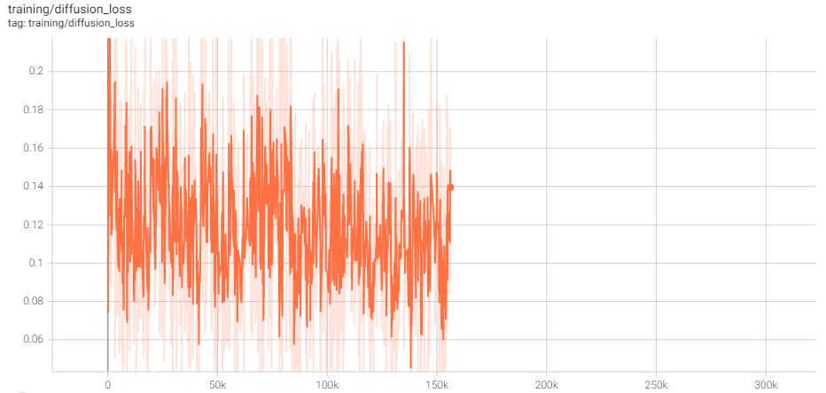
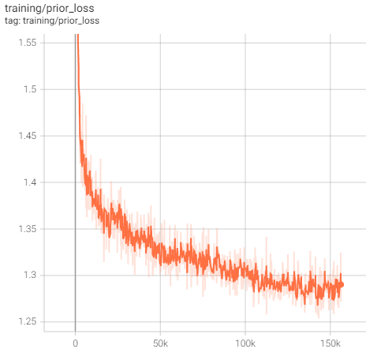
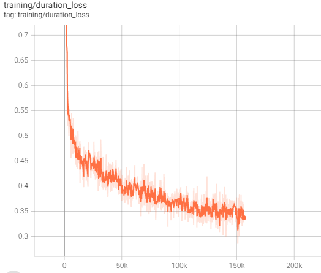

# Grad-TTS (Unofficial Implementation)
This is my (unofficial) implementation of Grad-TTS [[1]](#1), a Text-to-Speech model based on Probabilistic Diffusion Models. It uses the official implementation [[2]](#2) as a reference, which in turn relies partly on the code of Glow-TTS [[3]](#3). Additionally, HiFiGAN [[4]](#4) is used as the vocoder in this work, just like the official implementation.

Note: samples of the outputs can be found in `data/samples/`.

### Note about all commands below
Some machines such as mine associate `pip` and `python` to `pip2` and `python2` respectively. If this is the case, replace `pip` and `python` with `pip3` and `python3` in all of the commands below.

## Requirements
To install the requirements, run
```
pip install -r requirements.txt
```
Additionally, if you wish to train the model using the `LJSpeech` dataset like I did, download it from [[5]](#5) and untar it to `data/LJSpeech-1.1/` so that the model can find it. If you use a different location, modify `config.py` accordingly. 

## Project Structure
The project is structured in the following way:
- `data/` has the data related to training and inference
- `checkpts/` store the model and optimizer checkpoints. In the interest of storage, we only provide model checkpoints of the 100-th and 200-th epochs.
- `hifigan/` and `hifigan-checkpts/` contain the hifigan code and checkpoint(s).
- `utils/globals.py` has the global variables that are not configuration parameters and are used by many modules. On the other hand `utils/data.py` has functions related to loading, preprocessing and bundling of data into `Dataset`/`DataLoader`s.
- `models/alignment/` has the cython module for maximum alignment search, heavily referenced on the official equivalent.
- `models/models.py` defines the various models that are either used directly or indirectly via other models.
- `models/training.py` exposes functions to instantiate and train the above models, while `models/inference.py` has a function to do the entire conversion of text-to-speech.
- Finally, `main.py` ties everything together and interfaces with the user, who can change `config.py` to change various aspects of training and/or inference.
- `notebook/` contains the original notebook which I used for this work.

## Usage
After downloading the LJSpeech dataset and placing it in `data/LJSpeech-1.1` and changing the configuration in `config.py` if you want, you can run
```
python main.py --train
```
to train. This will by default save checkpoints, resume from last checkpoint and launch a tensorboard instance.
If you want to convert text to speech and not train the model, LJSpeech need not be downloaded. Simply run
```
python main.py --tts <string-to-convert> --out <path-to-output>
```
or
```
python main.py --file --tts <path-to-in-file> [--out <path-to-output>]
```
in the latter case, if an output path is unspecified, `X.txt`'s output will be saved to `X.wav`, for the input `X.txt`. 

## Overview and Models
While a complete description of the model is infeasible to include in such little space (and readers are referred to [[1]](#1)), here is the rough idea (entirely based on the paper):

Consider a member of a distribution of "objects" (vectors), such as an image, and subjecting it, called $X_t$ at time $t$ to
$$ dX_t = b(X_t,t)dt + a(X_t,t)dW_t $$
where  $a,b $ are functions of  $X_t $ and  $t $. If we momentarily take  $b \equiv 0 $, we see that this corresponds to adding Guassian noise to the image over time. As a special case, if  $a \equiv 1 $ we get Brownian motion. The idea is that by slowly adding Guassian noise as above, we eventually reach a point where the original "structure" is lost and  $X_t $ may have as well been drawn from a Guassian  $\mathcal N(\mu, \Sigma) $. Here, $\mu, \Sigma$ may be calculated for a $t$ if $a,b$ are known. This represents "diffusion" of $X_t$ into noise. As it turns out, this diffusion may be solved in reverse [[6]](#6):
$$ dX_t = \left(\frac{1}{2}\Sigma^{-1}(\mu - X_t) - \nabla \log p_t(X_t)\right)\beta_tdt + \sqrt{\beta_t}d\tilde{W_t} $$
Here  $\tilde{W_t} $ is a reverse-time Brownian motion - what's more, we can get an equation without this that has the same Forward Kolmogorov Equation (and this describes an equivalent process) [[7]](#7):
$$ dX_t = \frac{1}{2}\left(\Sigma^{-1}(\mu - X_t) - \nabla \log p_t(X_t)\right)\beta_tdt $$
(the  $\frac{1}{2} $ has moved outside now, so it's not quite the same as just removing the  $d\tilde{W_t} $). This means that we can convert Guassian noise back to members of whatever distribution (images, speech, and so on) we desire. How does this fit in? In Grad-TTS, first each text input is first passed through a text encoder. The latter is similar to a transformer encoder, with the difference that attention layers are now replaced with *relative attention* layers. In these, the attention is 
- $0$ outside a window of  $W $ on either size
- unevenly distributed inside the window - the exact weightage is learnt, and is different across heads and across  $Q,K,V $ s.

Then, a duration predictor (a simple CNN) predicts factors by which to inflate each frame of the output above. This in turn is taken to be  $\mu $ above. Further  $\Sigma = I $ is assumed for simplification. Then the reverse ODE is solved to produce the mel-spectrogram of the target audio. The one unknown in it, namely  $\nabla \log p_t(X_t) $ is predicted by a UNet [[8]](#8)-style network at each step of solving the ODE (we use Euler's method). The final mel-spectrogram is converted back to audio using a vocoder. HiFiGAN [[4]](#4) works well for this. All models contain a combined total of 14.84M trainable parameters.

Acknowledgements: The text encoder uses CMUDict [[9, 10]](#9) to map words into phonemes, which are then passed through an embedding layer and a pre-net (simple CNN with Mish [[11]](#10) activations).
## Losses
The loss function has three components. First, during training, we get the gold-truth alignment between text and speech using Monotonic Alignment Search (a simple Dynamic Programming algorithm, see [[3]](#3)) - this gives us the "ground truth" values that the Duration Predictor should have output for each position. This is turned into an MSE loss term:
$$ d_i = \log \sum_{j=1}^F \mathbb{I}_{\{A^*(j)=i\}},\hspace{1.1em}i=1,2,\cdots,L, $$

(extra line just because GitHub markdown LaTeX rendering is super buggy and needs specific things like a space before ending dollar but not after first, and no consecutive full-line equations)
$$ \mathcal{L}_{dp} = \text{MSE}(\text{DP}(\text{sg}[\tilde{\mu}, d])) $$

The prior or encoder loss enforces the text encoder's output after inflation by the duration predictor to be close (enough) to the actual mel-spectrogram:
$$ \mathcal{L}_{enc} = -\sum_{j=1}^F \log \varphi(y_j;\tilde{\mu}_{A(j)}, I) $$

There is also a loss term to ensure that the gradient predictions are correct. First, with  $\Sigma = I $ at  $t=T $ as we take it, the covariance matrix at time  $t $ is just  $\lambda_tI $ with
$$ \lambda_t = 1 - \exp\left(-\int_0^t \beta_sds\right) $$
and so  $X_t $ is effectively sampled from a guassian of the form  $\mathcal N(\mu_t, \lambda_tI) $, or as  $\mu_t+\sqrt{\lambda_t}\xi_t $ with  $\xi_t $ from  $\mathcal N(0,I) $. Then the gradient of the log-probability can be calculated as  $-\frac{\xi_t}{\sqrt{\lambda_t}} $. The final loss term is
$$ \mathcal L_{diff} = \mathbb{E}_{X_0,t}\left[\lambda_t\mathbb{E}_{\xi_t}\left[\left|\left|s_\theta(X_t,\mu,t)+\frac{\xi_t}{\sqrt{\lambda_t}}\right|\right|\right]\right] $$
## Training
The graphs below show the training losses w.r.t to time
<figure>
<center>
 
<figcaption>Diffusion Loss</figcaption>
 
<figcaption>Prior/Encoder Loss</figcaption>
 
<figcaption>Duration Loss</center></figcaption>
</figure>
Note that the diffusion loss fluctuating a lot and apparanetly not decreasing is expected, as noted in [[1]](#1).

### Note
I originally implemented the code on Google Colab, and then ported it over to a "traditional" repository format, so some errors may have crept in, though I did run the code on my PC to verify it. If you find any bugs, I'd love to hear from you and fix it ASAP.

## References
<a id="1">[1]</a> Grad-TTS: A Diffusion Probabilistic Model for Text-to-Speech, [ICML 2021](http://proceedings.mlr.press/v139/popov21a.html), Vadim Popov, Ivan Vovk, Vladimir Gogoryan, Tasnima Sadekova, Mikhail Kudinov 

<a id="2">[2]</a> [Grad-TTS official implementation](https://github.com/huawei-noah/Speech-Backbones), last acessed June 16, 2022.

<a id="3">[3]</a> Glow-TTS: A Generative Flow for Text-to-Speech via Monotonic Alignment Search, [NeurIPS 2020](https://arxiv.org/abs/2005.11129), Jaehyeon Kim, Sungwon Kim, Jungil Kong, Sungroh Yoon

<a id="4">[4]</a> HiFi-GAN: Generative Adversarial Networks for Efficient and High Fidelity Speech Synthesis, [NeurIPS 2020](https://arxiv.org/abs/2010.05646), Jungil Kong, Jaehyeon Kim, Jaekyoung Bae

<a id="5">[5]</a> [The LJSpeech Dataset](https://keithito.com/LJ-Speech-Dataset/), last accessed June 16, 2022

<a id="6">[6]</a> [Reverse-Time Diffusion Equation Models](https://core.ac.uk/download/pdf/82826666.pdf), "Stochaistic Processes and their Applications 12" (1982), Brian D.O. Anderson

<a id="7">[7]</a> Score-Based Generative Modeling through Stochastic Differential Equations, [ICML 2021](https://arxiv.org/abs/2011.13456), Yang Song, Jascha Sohl-Dickstein, Diederik P. Kingma, Abhishek Kumar, Stefano Ermon, Ben Poole

<a id="8">[8]</a> U-Net: Convolutional Networks for Biomedical Image Segmentation, [MICCAI 2015](https://arxiv.org/abs/1505.04597), Olaf Ronneberger, Philipp Fischer, Thomas Brox

<a id="9">[9]</a> [CMUDict](https://github.com/cmusphinx/cmudict), last accessed June 16, 2022.

<a id="10">[10]</a> [CMUDict (pip)](https://pypi.org/project/cmudict/), last accessed June 16, 2022.

<a id="11">[11]</a> Mish: A Self Regularized Non-Monotonic Activation Function, [BMVC 2020](https://arxiv.org/abs/1908.08681), Diganta Misra